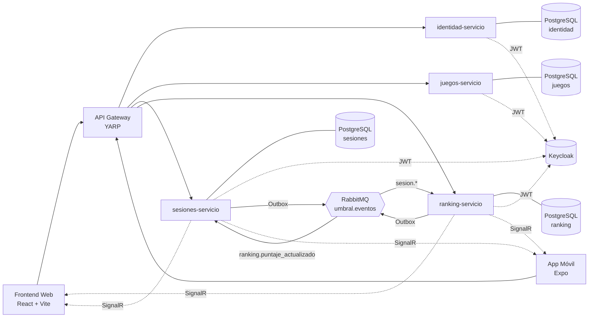

# UMBRAL

**UMBRAL** es una plataforma de juegos y sesiones en vivo con un **panel web** para
**Administrador** y **Operador**, y una **app móvil** para el **Participante**.

El backend está construido con **.NET 9 / ASP.NET Core** siguiendo **microservicios**,
**arquitectura hexagonal** y **CQRS con MediatR**. La autenticación se delega en **Keycloak**
(JWT) y cada microservicio tiene su propia base de datos **PostgreSQL**. Un **API Gateway (YARP)**
expone una sola entrada pública. Los servicios se comunican de forma **asíncrona mediante RabbitMQ
con patrón Outbox**, y notifican en **tiempo real con SignalR/WebSockets**. Todo se levanta con
**Docker Compose**.

Actualmente el sistema tiene **cuatro microservicios de negocio** —
**identidad**, **juegos**, **sesiones** y **ranking** — y RabbitMQ **sí es consumido**:
`sesiones-servicio` publica hechos de juego y `ranking-servicio` calcula el puntaje autoritativo
y devuelve el resultado.

---

## Tabla de contenido

1. [Descripción general](#1-descripción-general)
2. [Tecnologías utilizadas](#2-tecnologías-utilizadas)
3. [Arquitectura del proyecto](#3-arquitectura-del-proyecto)
4. [Arquitectura hexagonal por microservicio](#4-arquitectura-hexagonal-por-microservicio)
5. [Patrones y principios aplicados](#5-patrones-y-principios-aplicados)
6. [Comunicación asíncrona: RabbitMQ y Outbox](#6-comunicación-asíncrona-rabbitmq-y-outbox)
7. [Tiempo real: SignalR](#7-tiempo-real-signalr)
8. [Ranking: cálculo autoritativo de puntaje](#8-ranking-cálculo-autoritativo-de-puntaje)
9. [Decisiones de alcance](#9-decisiones-de-alcance)
10. [Estructura de carpetas](#10-estructura-de-carpetas)
11. [Funcionalidades principales](#11-funcionalidades-principales)
12. [Requisitos previos](#12-requisitos-previos)
13. [Configuración de variables de entorno](#13-configuración-de-variables-de-entorno)
14. [Cómo levantar todo con Docker](#14-cómo-levantar-todo-con-docker)
15. [URLs importantes](#15-urls-importantes)
16. [Credenciales iniciales](#16-credenciales-iniciales)
17. [Bases de datos](#17-bases-de-datos)
18. [Endpoints principales](#18-endpoints-principales)
19. [Cómo correr backend, web y móvil sin Docker](#19-cómo-correr-backend-web-y-móvil-sin-docker)
20. [Cómo correr las pruebas](#20-cómo-correr-las-pruebas)
21. [Integración continua (CI)](#21-integración-continua-ci)
22. [Logging y manejo de errores](#22-logging-y-manejo-de-errores)
23. [Flujo básico de prueba manual](#23-flujo-básico-de-prueba-manual)
24. [Problemas comunes](#24-problemas-comunes)
25. [Estado del proyecto](#25-estado-del-proyecto)

---

## 1. Descripción general

UMBRAL tiene tres roles:

- **Administrador**: gestiona usuarios internos (operadores y otros administradores), activa,
  desactiva y elimina operadores, resetea contraseñas, administra el catálogo de juegos
  (trivias, búsquedas del tesoro y misiones) y consulta participantes. Entra por el panel web.
- **Operador**: consulta el contenido activo, crea y gestiona **sesiones** de juego y **equipos**,
  ejecuta las sesiones (inicio de etapas, liberación manual de pistas, pausa/reanudación) y modera
  las sesiones que él mismo crea (expulsiones). Entra por el panel web.
- **Participante**: usa la **app móvil**. Se registra, mantiene su perfil, consulta las sesiones
  disponibles, ingresa a sesiones (individuales o por equipo), juega Trivia y Búsqueda del Tesoro,
  ve su puntaje y ranking en tiempo real, abandona sesiones y puede eliminar su propia cuenta.

---

## 2. Tecnologías utilizadas

| Capa | Tecnologías |
|------|-------------|
| Backend | .NET 9, ASP.NET Core, MediatR (CQRS), EF Core 9, Mapster |
| Bases de datos | PostgreSQL 16 (una por microservicio + la de Keycloak) |
| Identidad | Keycloak 24 (realm `umbral`, JWT) |
| API Gateway | YARP (reverse proxy) |
| Mensajería asíncrona | RabbitMQ (exchange topic `umbral.eventos`) con patrón **Outbox** — **consumido** por los servicios |
| Tiempo real | SignalR / WebSockets (hub de **sesiones** y hub de **ranking**) |
| Frontend web | React 18 + Vite + TypeScript |
| Frontend móvil | React Native + Expo (expo-router) |
| Contenedores | Docker / Docker Compose |
| Pruebas | xUnit, FluentAssertions, Moq, `Microsoft.AspNetCore.Mvc.Testing` (WebApplicationFactory), EF Core InMemory, coverlet |

---

## 3. Arquitectura del proyecto

UMBRAL se compone de **cuatro microservicios de negocio**, un **API Gateway**, dos frontends y la
infraestructura de apoyo (Keycloak, PostgreSQL y RabbitMQ).

- **identidad-servicio**: usuarios y autenticación. Administradores, operadores y participantes;
  roles y estados de cuenta (Activo/Inactivo); integración con Keycloak; contraseñas temporales y
  envío de correos (SMTP).
- **juegos-servicio**: catálogo de contenido. Trivias (preguntas y opciones), búsquedas del tesoro
  (pistas), misiones (etapas) y consulta de contenidos activos. Maneja estados Borrador / Activa /
  Inactiva.
- **sesiones-servicio**: sesiones de juego en vivo. Creación y gestión de sesiones, equipos,
  ingreso/abandono de participantes, expulsiones, ejecución de etapas (Trivia/Tesoro), liberación
  manual de pistas, progreso secuencial, historial y **hub de sesiones** (SignalR). Publica hechos
  de juego hacia ranking mediante Outbox/RabbitMQ y aplica los resultados de puntaje que recibe.
- **ranking-servicio**: **fuente autoritativa del cálculo de puntaje**. Consume los eventos de
  juego, aplica las estrategias de puntaje, mantiene el ranking por sesión (participantes y
  equipos) y el ranking global, publica el resultado autoritativo de vuelta a sesiones y notifica
  en tiempo real por su propio **hub de ranking** (SignalR).
- **api-gateway** (YARP): expone una sola entrada pública en `http://localhost:5000` y enruta a
  cada microservicio; también reenvía el handshake WebSocket de los hubs de sesiones y de ranking.
- **frontend-web**: panel administrativo/operador (React + Vite).
- **frontend-movil**: app del participante (Expo).
- **Keycloak**: fuente de verdad de credenciales; emite los JWT que consumen los microservicios.
- **PostgreSQL**: una base por microservicio, más la base propia de Keycloak.
- **RabbitMQ**: broker de mensajería **en uso**. `sesiones-servicio` publica los hechos de juego y
  `ranking-servicio` los consume y devuelve el resultado (ver sección 6).



---

## 4. Arquitectura hexagonal por microservicio

Cada microservicio separa el negocio de los detalles técnicos en proyectos independientes:

| Proyecto | Responsabilidad |
|----------|-----------------|
| `*.Dominio` | Entidades, objetos de valor y reglas de negocio. **No** depende de EF Core, HTTP, Keycloak, RabbitMQ, logging ni infraestructura. |
| `*.Aplicacion` | Casos de uso con MediatR (comandos y consultas), **puertos** (interfaces), validaciones y servicios de aplicación. |
| `*.Infraestructura` | Implementaciones concretas: EF Core, repositorios, RabbitMQ (consumidores/publicadores/Outbox), SignalR, Keycloak, correo y demás adaptadores de los puertos. |
| `*.Presentacion` | Controladores, middlewares HTTP, configuración web, Swagger y autenticación. Solo orquesta hacia MediatR. |
| `*.Commons` | DTOs compartidos entre capas. |

`identidad-servicio`, `juegos-servicio` y `sesiones-servicio` tienen los cinco proyectos.
`ranking-servicio` tiene `Dominio`, `Aplicacion`, `Infraestructura` y `Presentacion` (no usa un
proyecto `Commons` propio).

> **¿Por qué MediatR vive en Aplicación y no se considera infraestructura?** MediatR solo
> implementa el patrón *mediator* para despachar comandos y consultas dentro de la propia capa de
> aplicación (in-process). No aporta acceso a datos, red ni framework externo: es el mecanismo que
> orquesta los casos de uso. Por eso pertenece a Aplicación y no rompe la inversión de dependencias.
> El acceso a datos, Keycloak, RabbitMQ, SignalR, correo, etc. sí quedan detrás de **puertos**
> implementados en Infraestructura.

---

## 5. Patrones y principios aplicados

Patrones realmente presentes en el código:

- **Arquitectura hexagonal (puertos y adaptadores)**: el dominio y la aplicación definen puertos
  (interfaces) y la infraestructura los implementa.
- **CQRS**: comandos (escritura) y consultas (lectura) separados en `*.Aplicacion`.
- **Mediator**: MediatR despacha comandos/consultas a sus manejadores.
- **Repository**: interfaces `IRepositorio*` en Dominio/Aplicación, implementadas con EF Core.
- **Inyección de dependencias**: contenedor de ASP.NET Core; cada capa registra sus servicios
  (`RegistroAplicacion`, `RegistroInfraestructura`).
- **Strategy**: cálculo de puntaje en ranking mediante `IEstrategiaCalculoPuntaje<TContexto>`
  (`EstrategiaPuntajeTriviaPorTiempo`, `EstrategiaPuntajeBusquedaTesoro`).
- **Composite**: modelo de contenido de juegos con `IComponenteJuego` (Trivia, Búsqueda del Tesoro,
  Etapa, Pista).
- **Template Method**: validaciones de juegos con `ValidadorBase<TSolicitud>` y validadores
  concretos (crear/modificar trivia, misión, búsqueda; agregar pregunta/pista/etapa).
- **Outbox**: sesiones y ranking persisten los eventos salientes en una tabla Outbox y un
  despachador los publica a RabbitMQ de forma confiable.
- **Reverse proxy (API Gateway)**: YARP concentra la entrada pública y enruta a los microservicios.

Para ser explícitos sobre lo que **no** existe (para evitar documentación engañosa):

- **No** hay Chain of Responsibility implementado.
- **No** hay entidad ni flujo de penalizaciones.
- **No** hay pruebas E2E (ver secciones 9 y 20).

---

## 6. Comunicación asíncrona: RabbitMQ y Outbox

RabbitMQ **está en uso**. El intercambio es un **exchange de tipo topic** llamado
`umbral.eventos`. Ambos sentidos usan el patrón **Outbox**: el evento se persiste en la misma
transacción que el cambio de negocio y un despachador en segundo plano lo publica, garantizando
que no se pierda ni se publique a medias.

Flujo real actual:

```text
sesiones-servicio
  → escribe el hecho de juego + fila Outbox (misma transacción)
  → despachador Outbox publica a RabbitMQ (exchange umbral.eventos)
     routing keys: sesion.respuesta_trivia
                   sesion.evidencia_tesoro
                   sesion.participante_unido
                   sesion.equipo_creado
ranking-servicio
  → consume esos eventos (idempotencia por evento procesado)
  → aplica la estrategia de puntaje y persiste el Ranking de la sesión
  → notifica por SignalR (hub de ranking)
  → escribe su propia fila Outbox y publica el resultado autoritativo
     routing key: ranking.puntaje_actualizado
sesiones-servicio
  → consume ranking.puntaje_actualizado
  → actualiza PuntosGanados de la respuesta/evidencia correlacionando por
    EventoPuntuacionId == EventoIdOrigen (historial y snapshots)
```

Notas:

- **Idempotencia**: `ranking-servicio` registra los eventos ya procesados; un mismo evento
  reentregado no vuelve a sumar puntaje ni a reemitir el resultado.
- Los eventos transportan **solo identificadores** y los datos crudos necesarios; ranking enriquece
  nombres/alias por consulta HTTP cuando los necesita. No se comparte dominio entre microservicios.
- Los mensajes que fallan de forma persistente se envían a una cola *dead-letter* (`<cola>.dlq`).

---

## 7. Tiempo real: SignalR

Hay **dos hubs** SignalR, ambos accesibles por el gateway y protegidos con JWT. SignalR **solo
notifica**; la fuente de verdad sigue siendo HTTP.

**Hub de sesiones** — `/hubs/sesiones` (gateway) · `/hubs/sesiones` (directo). Notifica, entre
otros: sesión actualizada (cambios de estado), participantes/equipos actualizados, equipo
actualizado, expulsión de participante/equipo, inicio de etapa y etapa por comenzar, etapa
completada, respuesta registrada, progreso secuencial actualizado y **pista liberada**.

**Hub de ranking** — `/hubs/ranking` (gateway) · `/hubs/ranking` (directo). Notifica: **puntaje
calculado**, **ranking de participantes actualizado** y **ranking de equipos actualizado**.

---

## 8. Ranking: cálculo autoritativo de puntaje

`ranking-servicio` es el **único responsable de calcular el puntaje**. `sesiones-servicio` no
calcula puntaje: solo publica hechos crudos (respuesta de trivia, evidencia de tesoro, ingreso de
participante, creación de equipo) y luego **aplica** el resultado autoritativo que ranking le
devuelve.

Dominio de ranking:

- **Ranking por sesión**: un agregado `Ranking` por sesión que contiene `RankingParticipante` y
  `RankingEquipo`. El puntaje de un equipo es la **suma** de los puntajes de sus participantes.
- **Ranking global**: proyección de lectura sobre todas las sesiones.
- **Estrategias de puntaje** (patrón Strategy):
  - Trivia: `EstrategiaPuntajeTriviaPorTiempo` (puntaje según rapidez de la respuesta correcta).
  - Búsqueda del Tesoro: `EstrategiaPuntajeBusquedaTesoro`.
- **Idempotencia**: registro de eventos procesados para no puntuar dos veces el mismo evento.
- **Tiempo real**: publica los cambios por el hub de ranking.

Ranking conoce a los competidores por identificadores (participante, equipo, sesión). **No**
modela misiones ni etapas como parte de su dominio: esos conceptos pertenecen al bounded context
de sesiones/juegos.

Endpoints de consulta (ver sección 18): ranking de participantes y de equipos por sesión, y
ranking global.

---

## 9. Decisiones de alcance

Estas son **decisiones explícitas de alcance** de la versión actual, no defectos:

**Pistas (Búsqueda del Tesoro):**

- La liberación de pistas es **manual por parte del Operador**.
- Una pista liberada se hace visible para **todos los participantes/equipos** de esa sesión en esa
  etapa; **no** existen pistas específicas por equipo.
- **No** existe liberación automática condicionada por reglas.

**Pruebas:**

- Existen pruebas **unitarias** y pruebas de **integración** (donde están implementadas: identidad
  y sesiones).
- **No** existen pruebas **E2E** en esta versión (ni Playwright, Cypress, Selenium ni Appium).
- Esta versión **no** exige un umbral mínimo de cobertura (p. ej. 90 %); la cobertura se **genera**
  como evidencia pero no se aplica como *gate* que rompa el pipeline.

---

## 10. Estructura de carpetas

```text
UMBRAL/
├── backend/
│   ├── servicios/
│   │   ├── identidad-servicio/      # microservicio de identidad
│   │   │   ├── IdentidadServicio.Dominio/
│   │   │   ├── IdentidadServicio.Aplicacion/
│   │   │   ├── IdentidadServicio.Infraestructura/
│   │   │   ├── IdentidadServicio.Presentacion/
│   │   │   └── IdentidadServicio.Commons/
│   │   ├── juegos-servicio/         # microservicio de juegos (5 proyectos)
│   │   ├── sesiones-servicio/       # microservicio de sesiones (5 proyectos)
│   │   └── ranking-servicio/        # microservicio de ranking
│   │       ├── RankingServicio.Dominio/
│   │       ├── RankingServicio.Aplicacion/
│   │       ├── RankingServicio.Infraestructura/
│   │       └── RankingServicio.Presentacion/
│   ├── gateway/
│   │   └── api-gateway/             # YARP (entrada única)
│   └── pruebas/
│       ├── identidad/               # pruebas unitarias e integración de identidad
│       ├── juegos/                  # pruebas unitarias de juegos
│       ├── sesiones/                # pruebas unitarias e integración de sesiones
│       └── ranking/                 # pruebas unitarias de ranking
├── frontend-web/
│   └── umbral-web-react/            # panel web (React + Vite)
├── frontend-movil/
│   └── umbral-app-react-native/     # app móvil (Expo)
├── infraestructura/
│   └── keycloak/
│       └── realm-umbral.json        # configuración del realm que Keycloak importa
├── .github/workflows/ci.yml         # pipeline de CI (backend + frontends)
├── .env.example                     # variables de referencia (correo, etc.)
├── docker-compose.yml
├── verificar-backend.ps1            # script de compilación + pruebas + cobertura
└── UMBRAL.sln                       # solución raíz (código productivo + pruebas)
```

Las pruebas viven **fuera** de los microservicios para separar el código productivo del de
pruebas. La solución raíz `UMBRAL.sln` integra todo.

---

## 11. Funcionalidades principales

**Identidad**

- **Login web** para Administrador y Operador (`login-web`) y **login móvil** para Participante
  (`login-movil`).
- **Registro público** de participante desde la app móvil.
- **Gestión de usuarios internos**: alta de administradores/operadores, modificación, activación,
  desactivación, eliminación y reseteo de contraseña.
- **Gestión de participantes**: listado, detalle, activación/desactivación y edición/eliminación
  del propio perfil.

**Juegos**

- **Trivias**: crear, listar (borrador/activas), modificar, agregar/editar/eliminar preguntas y
  opciones, activar y eliminar.
- **Búsquedas del tesoro**: crear, listar, modificar, agregar/editar/eliminar pistas, activar y
  eliminar.
- **Misiones**: crear, listar, modificar, agregar/eliminar etapas, activar y eliminar; detalle
  recortado para el participante.

**Sesiones**

- **Gestión de sesiones**: crear, listar, ver detalle, modificar y eliminar.
- **Sesiones individuales y grupales**, con **equipos** (crear, ver, modificar, eliminar).
- **Ingreso de participantes**: a sesiones individuales, por código de acceso o a un equipo.
- **Ejecución**: inicio de etapas, progreso secuencial, **pausa/reanudación**, **liberación manual
  de pistas**, finalización.
- **Trivia y Búsqueda del Tesoro** en vivo, con validación de QR y primera evidencia válida por
  participante/equipo.
- **Abandono de sesión** y **expulsiones** (líder del equipo u operador).
- **Historial** de resultados por participante.

**Ranking**

- **Cálculo autoritativo del puntaje** (Trivia y Tesoro).
- **Ranking por sesión** de participantes y de equipos.
- **Ranking global**.
- **Actualización en tiempo real** por SignalR.

**Transversal**

- **Logging técnico**, manejo global de excepciones y **CorrelationId** por petición.
- **Envío de correos** de contraseñas temporales cuando el SMTP está habilitado.

---

## 12. Requisitos previos

- **Docker Desktop** (para levantar todo con Docker Compose).
- **.NET 9 SDK** — necesario si se ejecuta el backend sin Docker o se corren las pruebas.
- **Node.js 20+ y npm** — necesarios si se ejecutan los frontends fuera de Docker.
- **Expo Go** (o un *development build*) en el celular para probar la app móvil.
- **PowerShell** para ejecutar `verificar-backend.ps1` en Windows.
- **DBeaver / Postman** (opcionales) para inspeccionar bases de datos y probar la API.

---

## 13. Configuración de variables de entorno

En el repo existe un archivo `.env.example` en la raíz con las variables de referencia. El
`docker-compose.yml` ya inyecta valores por defecto; solo necesitas un `.env` propio si quieres
personalizar (por ejemplo, para activar los correos).

### 13.1 Archivo `.env` en la raíz para Docker Compose (correo)

El `identidad-servicio` puede enviar correos de contraseñas temporales (alta administrativa y
reseteo) por **SMTP**. Esa configuración se toma de variables de entorno; puedes crear un `.env`
en la raíz del repositorio partiendo de `.env.example`.

Valores por defecto (correo **desactivado**):

```env
CORREO_HABILITADO=false
CORREO_HOST=
CORREO_PUERTO=587
CORREO_USAR_SSL=true
CORREO_USUARIO=
CORREO_CONTRASENA=
CORREO_REMITENTE=no-reply@umbral.local
CORREO_REMITENTE_NOMBRE=UMBRAL
```

Ejemplo para Gmail o Mailtrap (**sin credenciales reales**):

```env
CORREO_HABILITADO=true
CORREO_HOST=smtp.gmail.com
CORREO_PUERTO=587
CORREO_USAR_SSL=true
CORREO_USUARIO=tu_correo@gmail.com
CORREO_CONTRASENA=tu_app_password
CORREO_REMITENTE=tu_correo@gmail.com
CORREO_REMITENTE_NOMBRE=UMBRAL
```

Aclaraciones:

- **No** subas tu `.env` al repositorio.
- Para **Gmail** debes usar una **contraseña de aplicación (App Password)**, no la contraseña
  normal de la cuenta.
- Si `CORREO_HABILITADO=false`, el sistema **no envía correos reales**: solo registra en los logs
  que el envío fue solicitado y nunca expone la contraseña temporal.
- Nunca coloques contraseñas reales en el repositorio ni en la documentación.

### 13.2 Variables del frontend web

El frontend web usa `VITE_API_URL` para saber dónde está el gateway. En Docker Compose ya se
define como `http://localhost:5000`. Si lo ejecutas fuera de Docker, puedes crear un `.env` en
`frontend-web/umbral-web-react/`:

```env
VITE_API_URL=http://localhost:5000
```

### 13.3 Variables del frontend móvil con Expo

La app móvil lee la URL del backend desde `EXPO_PUBLIC_API_URL` (ver
`frontend-movil/umbral-app-react-native/servicios/clienteHttp.ts`). Si no se define, usa
`http://localhost:5000` por defecto.

Crea un archivo `.env` en `frontend-movil/umbral-app-react-native/`:

```env
EXPO_PUBLIC_API_URL=http://IP_DE_TU_PC:5000
```

Explicación importante:

- En un **celular físico**, `http://localhost:5000` **no sirve**: `localhost` sería el propio
  celular, no tu PC.
- Debes usar la **IP local de tu PC** en la misma red Wi-Fi, por ejemplo:
  `EXPO_PUBLIC_API_URL=http://192.168.1.9:5000`.
- El celular y la PC deben estar en la **misma red Wi-Fi**.
- Si usas un **emulador Android**, suele aplicar `http://10.0.2.2:5000`.
- Después de cambiar el `.env`, reinicia Expo limpiando la caché:

```bash
npx expo start -c
```

---

## 14. Cómo levantar todo con Docker

Con Docker Compose se levantan los **cuatro microservicios**, el API Gateway, el frontend web,
Keycloak, RabbitMQ y las **cinco bases de datos PostgreSQL** (una por microservicio + Keycloak).
**No hace falta instalar .NET ni Node** para correr los contenedores; solo Docker Desktop.

Desde la raíz del repositorio:

```powershell
# Levantar todo (en segundo plano, recompilando imágenes)
docker compose up -d --build

# Ver estado de los contenedores
docker compose ps

# Ver logs en vivo (todos los servicios)
docker compose logs -f

# Apagar sin borrar datos
docker compose down

# Apagar y borrar volúmenes (resetea bases de datos y Keycloak)
docker compose down -v
```

Aclaraciones:

- `docker compose down` **no borra datos**: los volúmenes de PostgreSQL y Keycloak se conservan.
- `docker compose down -v` **borra los volúmenes**: se pierden todos los datos locales y Keycloak
  vuelve a importar `realm-umbral.json` al levantar de nuevo. Úsalo solo para arrancar desde cero.
- Las **migraciones EF Core se aplican automáticamente** al arrancar cada microservicio, así que
  las bases quedan listas sin pasos manuales.
- Si cambiaste código backend o un Dockerfile, vuelve a construir con `--build`.
- Si solo quieres reiniciar un servicio sin reconstruir: `docker compose restart <servicio>`.

La app móvil tiene un **perfil opcional** que levanta el bundler de Expo dentro de Docker:

```powershell
docker compose --profile movil up -d --build
```

> En la práctica, para probar en un **celular físico** suele ser más cómodo ejecutar Expo **fuera
> de Docker** (ver la sección 19), porque el celular se conecta directo al Metro Bundler de tu PC.

---

## 15. URLs importantes

| Servicio | URL |
|----------|-----|
| Frontend web | http://localhost:3000 |
| API Gateway | http://localhost:5000 |
| identidad-servicio (directo) | http://localhost:5001 |
| juegos-servicio (directo) | http://localhost:5002 |
| sesiones-servicio (directo) | http://localhost:5003 |
| ranking-servicio (directo) | http://localhost:5004 |
| Keycloak | http://localhost:8080 |
| RabbitMQ (panel de administración) | http://localhost:15672 |
| Swagger identidad (entorno Development) | http://localhost:5001/swagger |
| Swagger juegos (entorno Development) | http://localhost:5002/swagger |
| Swagger sesiones (entorno Development) | http://localhost:5003/swagger |
| Swagger ranking (entorno Development) | http://localhost:5004/swagger |
| Hub de sesiones vía gateway | http://localhost:5000/hubs/sesiones |
| Hub de ranking vía gateway | http://localhost:5000/hubs/ranking |

---

## 16. Credenciales iniciales

> ⚠️ Estas credenciales son **únicamente para desarrollo local** y deben rotarse en producción.

**Administrador inicial** (sembrado en Keycloak y en UMBRAL):

- Usuario: `administrador01`
- Contraseña: `Temporal123*`

**Administrador de Keycloak** (consola en `http://localhost:8080`):

- Usuario: `admin`
- Contraseña: `admin`

**RabbitMQ** (panel en `http://localhost:15672`):

- Usuario: `umbral`
- Contraseña: `umbral123`

Los demás usuarios (operadores y participantes) se crean a través de la aplicación.

---

## 17. Bases de datos

Cada microservicio tiene su **propia base de datos** para no compartir tablas ni dependencias.
Keycloak usa su PostgreSQL aparte.

| Servicio | Host | Puerto | Base de datos | Usuario | Contraseña |
|----------|------|--------|---------------|---------|------------|
| Keycloak | localhost | 5434 | keycloak | keycloak | keycloak123 |
| Identidad | localhost | 5433 | umbral_identidad | umbral | umbral123 |
| Juegos | localhost | 5435 | umbral_juegos | umbral | umbral123 |
| Sesiones | localhost | 5436 | umbral_sesiones | umbral | umbral123 |
| Ranking | localhost | 5437 | umbral_ranking | umbral | umbral123 |

Conexión rápida desde DBeaver: tipo **PostgreSQL**, host `localhost`, el puerto de la tabla y las
credenciales indicadas.

---

## 18. Endpoints principales

Normalmente todo se llama a través del **API Gateway** (`http://localhost:5000`). En desarrollo
también se puede llamar directo a cada microservicio (`5001` identidad, `5002` juegos, `5003`
sesiones, `5004` ranking). Salvo los marcados como *Anónimo*, todos requieren un **JWT** válido en
el encabezado `Authorization: Bearer <token>`.

Roles usados en las tablas: **Administrador**, **Operador**, **Participante**, **Anónimo**,
**Autenticado** (cualquier usuario con token) e **Interno** (endpoints que consume otro
microservicio).

### 18.1 identidad-servicio

**Autenticación** (`/api/autenticacion`)

| Método | Ruta | Descripción | Rol |
|--------|------|-------------|-----|
| POST | `/api/autenticacion/login-web` | Inicio de sesión desde el panel web. | Anónimo (Administrador / Operador) |
| POST | `/api/autenticacion/login-movil` | Inicio de sesión desde la app móvil. | Anónimo (Participante) |
| GET | `/api/autenticacion/perfil-actual` | Perfil del usuario autenticado. | Autenticado |
| POST | `/api/autenticacion/cambiar-contrasena-obligatoria` | Cambio obligatorio de la contraseña temporal. | Autenticado (Operador / Administrador) |

**Usuarios** (`/api/usuarios`)

| Método | Ruta | Descripción | Rol |
|--------|------|-------------|-----|
| POST | `/api/usuarios` | Crea un Administrador u Operador. | Administrador |
| POST | `/api/usuarios/participantes/registro` | Registro público de Participante. | Anónimo |
| GET | `/api/usuarios/participantes` | Listado paginado de participantes. | Administrador / Operador |
| GET | `/api/usuarios/participantes/{id}` | Detalle de un participante. | Administrador / Operador |
| GET | `/api/usuarios/internos` | Listado paginado de administradores y operadores. | Administrador |
| GET | `/api/usuarios/internos/{id}` | Detalle de un usuario interno. | Administrador |
| PATCH | `/api/usuarios/participantes/perfil` | El participante edita su propio perfil. | Participante |
| PATCH | `/api/usuarios/operadores/{id}` | Modifica los datos de un operador. | Administrador |
| PATCH | `/api/usuarios/operadores/{id}/activar` | Activa un operador. | Administrador |
| PATCH | `/api/usuarios/operadores/{id}/desactivar` | Desactiva un operador. | Administrador |
| PATCH | `/api/usuarios/participantes/{id}/activar` | Activa un participante. | Administrador / Operador |
| PATCH | `/api/usuarios/participantes/{id}/desactivar` | Desactiva un participante. | Administrador / Operador |
| DELETE | `/api/usuarios/operadores/{id}` | Elimina un operador (definitivo). | Administrador |
| DELETE | `/api/usuarios/participantes/perfil` | El participante elimina su propia cuenta. | Participante |
| POST | `/api/usuarios/internos/{id}/resetear-contrasena` | Resetea la contraseña de un usuario interno. | Administrador |
| POST | `/api/usuarios/internos/administradores-por-ids` | Filtra administradores por ids. | Interno |
| POST | `/api/usuarios/participantes/por-ids` | Datos básicos de participantes por ids (consumido por otros servicios). | Interno |

**Salud**: `GET /api/identidad/salud` (gateway) · `/salud` (directo).

### 18.2 juegos-servicio

En general, las operaciones de **escritura** exigen rol **Administrador**; las **consultas** de
detalle y de contenido activo admiten **Operador**; los endpoints `participante/...` son para el
**Participante**.

**Trivias** (`/api/juegos/trivias`)

| Método | Ruta | Descripción | Rol |
|--------|------|-------------|-----|
| POST | `/api/juegos/trivias` | Crea una trivia en estado Borrador. | Administrador |
| GET | `/api/juegos/trivias/borrador` | Lista de trivias en Borrador. | Administrador |
| GET | `/api/juegos/trivias/activas` | Lista de trivias activas. | Operador |
| GET | `/api/juegos/trivias/{triviaId}` | Detalle de la trivia con sus preguntas. | Operador |
| PUT | `/api/juegos/trivias/{triviaId}` | Modifica datos generales de la trivia. | Administrador |
| PATCH | `/api/juegos/trivias/{triviaId}/activar` | Publica la trivia (Borrador → Activa). | Administrador |
| DELETE | `/api/juegos/trivias/{triviaId}` | Desactiva la trivia. | Administrador |
| DELETE | `/api/juegos/trivias/{triviaId}/eliminar` | Elimina la trivia de forma definitiva. | Administrador |
| POST | `/api/juegos/trivias/{triviaId}/preguntas` | Agrega una pregunta. | Administrador |
| PUT | `/api/juegos/trivias/{triviaId}/preguntas/{preguntaId}` | Modifica una pregunta. | Administrador |
| DELETE | `/api/juegos/trivias/{triviaId}/preguntas/{preguntaId}` | Elimina una pregunta. | Administrador |

**Búsquedas del tesoro** (`/api/juegos/busquedas`)

| Método | Ruta | Descripción | Rol |
|--------|------|-------------|-----|
| POST | `/api/juegos/busquedas` | Crea una búsqueda del tesoro en Borrador. | Administrador |
| GET | `/api/juegos/busquedas/borrador` | Lista de búsquedas en Borrador. | Administrador |
| GET | `/api/juegos/busquedas/activas` | Lista de búsquedas activas. | Operador |
| GET | `/api/juegos/busquedas/{busquedaId}` | Detalle con sus pistas. | Operador |
| PATCH | `/api/juegos/busquedas/{busquedaId}` | Modifica la búsqueda. | Administrador |
| PATCH | `/api/juegos/busquedas/{busquedaId}/activar` | Publica la búsqueda (Borrador → Activa). | Administrador |
| DELETE | `/api/juegos/busquedas/{busquedaId}` | Desactiva la búsqueda. | Administrador |
| DELETE | `/api/juegos/busquedas/{busquedaId}/eliminar` | Elimina la búsqueda de forma definitiva. | Administrador |
| POST | `/api/juegos/busquedas/{busquedaId}/pistas` | Agrega una pista. | Administrador |
| PUT | `/api/juegos/busquedas/{busquedaId}/pistas/{pistaId}` | Modifica una pista. | Administrador |
| DELETE | `/api/juegos/busquedas/{busquedaId}/pistas/{pistaId}` | Elimina una pista. | Administrador |

**Misiones** (`/api/juegos/misiones`)

| Método | Ruta | Descripción | Rol |
|--------|------|-------------|-----|
| POST | `/api/juegos/misiones` | Crea una misión en Borrador. | Administrador |
| GET | `/api/juegos/misiones/borrador` | Lista de misiones en Borrador. | Administrador |
| GET | `/api/juegos/misiones/activas` | Lista de misiones activas. | Operador |
| GET | `/api/juegos/misiones/{misionId}` | Detalle de la misión (con etapas). | Operador |
| GET | `/api/juegos/misiones/participante/{misionId}` | Detalle recortado para el participante (solo si está Activa). | Participante |
| PATCH | `/api/juegos/misiones/{misionId}` | Modifica la misión. | Administrador |
| PATCH | `/api/juegos/misiones/{misionId}/activar` | Publica la misión. | Administrador |
| DELETE | `/api/juegos/misiones/{misionId}` | Desactiva la misión. | Administrador |
| DELETE | `/api/juegos/misiones/{misionId}/eliminar` | Elimina la misión de forma definitiva. | Administrador |
| POST | `/api/juegos/misiones/{misionId}/etapas` | Agrega una etapa. | Administrador |
| DELETE | `/api/juegos/misiones/{misionId}/etapas/{etapaId}` | Elimina una etapa. | Administrador |

**Contenidos activos**: `GET /api/juegos/contenidos-activos/{tipoJuego}/{contenidoId}` — verifica
que un contenido exista y esté Activo (consumido por sesiones-servicio). **Salud**:
`GET /api/juegos/salud` (gateway) · `/salud` (directo).

### 18.3 sesiones-servicio

**Sesiones** (`/api/sesiones`)

| Método | Ruta | Descripción | Rol |
|--------|------|-------------|-----|
| POST | `/api/sesiones` | Crea una sesión. | Operador |
| GET | `/api/sesiones` | Lista sesiones (Administrador: todas; Operador: las propias). Admite `?estado=`. | Administrador / Operador |
| GET | `/api/sesiones/{id}` | Detalle de una sesión. | Administrador / Operador |
| PUT | `/api/sesiones/{id}` | Modifica una sesión propia en estado Programada. | Operador |
| DELETE | `/api/sesiones/{id}` | Elimina una sesión propia en estado Programada. | Operador |
| DELETE | `/api/sesiones/{sesionId}/abandonar` | Abandona la sesión (individual) o el equipo (grupal). | Participante |
| GET | `/api/sesiones/misiones/{misionId}/existe-vigente` | Indica si una misión tiene sesiones vigentes (consumido por juegos-servicio). | Administrador / Operador (interno) |

**Sesiones disponibles (móvil)**

| Método | Ruta | Descripción | Rol |
|--------|------|-------------|-----|
| GET | `/api/sesiones/participante/disponibles` | Lista sesiones disponibles. Admite `?busqueda=` y `?modo=`. | Participante |
| GET | `/api/sesiones/participante/disponibles/{sesionId}` | Detalle de una sesión disponible. | Participante |

**Ingreso de participantes**

| Método | Ruta | Descripción | Rol |
|--------|------|-------------|-----|
| POST | `/api/sesiones/participante/ingresar` | Ingresa a una sesión por código de acceso. | Participante |
| POST | `/api/sesiones/{sesionId}/participante/ingresar-individual` | Ingresa a una sesión individual. | Participante |

**Equipos** (`/api/sesiones/{sesionId}/equipos`)

| Método | Ruta | Descripción | Rol |
|--------|------|-------------|-----|
| POST | `/api/sesiones/{sesionId}/equipos` | Crea un equipo. | Participante |
| GET | `/api/sesiones/{sesionId}/equipos` | Lista los equipos de la sesión. | Administrador / Operador / Participante |
| GET | `/api/sesiones/{sesionId}/equipos/{equipoId}` | Detalle de un equipo. | Administrador / Operador / Participante |
| PUT | `/api/sesiones/{sesionId}/equipos/{equipoId}` | Modifica un equipo (solo el líder). | Participante |
| DELETE | `/api/sesiones/{sesionId}/equipos/{equipoId}` | Elimina un equipo (solo el líder). | Participante |
| POST | `/api/sesiones/{sesionId}/equipos/{equipoId}/ingresar` | Ingresa a un equipo (si es privado, requiere contraseña). | Participante |
| DELETE | `/api/sesiones/{sesionId}/equipos/{equipoId}/participantes/{participanteSesionId}/expulsar` | Expulsa a un participante del equipo. | Operador / Participante (líder) |

**Expulsiones por el operador**

| Método | Ruta | Descripción | Rol |
|--------|------|-------------|-----|
| DELETE | `/api/sesiones/{sesionId}/participantes/{participanteSesionId}/expulsar` | Expulsa a un participante de una sesión individual. | Operador |
| DELETE | `/api/sesiones/{sesionId}/equipos/{equipoId}/expulsar` | Expulsa a un equipo completo de una sesión grupal. | Operador |

> Además, `sesiones-servicio` expone la ejecución en vivo (inicio de etapa, envío de respuesta de
> trivia, envío de evidencia de tesoro, liberación de pistas, progreso e historial); esas rutas las
> consume la app móvil y el panel del operador. **Salud**: `GET /api/sesiones/salud` (gateway) ·
> `/salud` (directo). **Tiempo real**: `WS /hubs/sesiones`.

### 18.4 ranking-servicio

| Método | Ruta | Descripción | Rol |
|--------|------|-------------|-----|
| GET | `/api/ranking/sesiones/{sesionId}/participantes` | Ranking de participantes de una sesión. | Autenticado |
| GET | `/api/ranking/sesiones/{sesionId}/equipos` | Ranking de equipos de una sesión. | Autenticado |
| GET | `/api/ranking/global?top={n}` | Ranking global (top N). | Participante |

**Salud**: `GET /api/ranking/salud` (gateway) · `/salud` (directo). **Tiempo real**:
`WS /hubs/ranking`.

---

## 19. Cómo correr backend, web y móvil sin Docker

Puedes ejecutar los componentes por separado. El backend sigue necesitando **PostgreSQL, Keycloak
y RabbitMQ**, que es más cómodo levantar con Docker (`docker compose up -d postgres-identidad
postgres-juegos postgres-sesiones postgres-ranking postgres-keycloak keycloak rabbitmq`).

**Backend** (desde la raíz):

```powershell
dotnet restore .\UMBRAL.sln
dotnet build .\UMBRAL.sln

# Ejecutar un microservicio (proyecto de Presentación)
dotnet run --project .\backend\servicios\identidad-servicio\IdentidadServicio.Presentacion
dotnet run --project .\backend\servicios\juegos-servicio\JuegosServicio.Presentacion
dotnet run --project .\backend\servicios\sesiones-servicio\SesionesServicio.Presentacion
dotnet run --project .\backend\servicios\ranking-servicio\RankingServicio.Presentacion

# API Gateway
dotnet run --project .\backend\gateway\api-gateway
```

**Frontend web:**

```powershell
Set-Location .\frontend-web\umbral-web-react
npm install
npm run dev        # sirve en http://localhost:3000
```

**Frontend móvil** (recuerda configurar `EXPO_PUBLIC_API_URL`, sección 13.3):

```powershell
Set-Location .\frontend-movil\umbral-app-react-native
npm install
npx expo start -c  # -c limpia la caché de Metro
```

---

## 20. Cómo correr las pruebas

### 20.1 Script completo

El script `verificar-backend.ps1` hace `restore`, `build` en configuración *Release* y ejecuta
**todas las suites** de prueba con cobertura, dejando los resultados en `artifacts/test-results`
(archivos `.trx` y `coverage.cobertura.xml`). Al final imprime un resumen con total, pasadas,
fallidas y omitidas por suite.

```powershell
.\verificar-backend.ps1
```

Modo silencioso (baja el nivel de logging durante las pruebas):

```powershell
.\verificar-backend.ps1 -Silencioso
```

Si PowerShell bloquea la ejecución de scripts:

```powershell
powershell -ExecutionPolicy Bypass -File .\verificar-backend.ps1
```

Las **seis suites** que ejecuta son:

- `sesiones-unitarias`
- `sesiones-integracion`
- `identidad-unitarias`
- `identidad-integracion`
- `juegos-unitarias`
- `ranking-unitarias`

> El script **genera** cobertura como evidencia (`coverage.cobertura.xml`) pero **no** impone un
> umbral mínimo: no falla por un porcentaje de cobertura.

### 20.2 Pruebas individuales

```powershell
dotnet test .\backend\pruebas\identidad\IdentidadServicio.PruebasUnitarias\IdentidadServicio.PruebasUnitarias.csproj
dotnet test .\backend\pruebas\identidad\IdentidadServicio.PruebasIntegracion\IdentidadServicio.PruebasIntegracion.csproj
dotnet test .\backend\pruebas\juegos\JuegosServicio.PruebasUnitarias\JuegosServicio.PruebasUnitarias.csproj
dotnet test .\backend\pruebas\sesiones\SesionesServicio.PruebasUnitarias\SesionesServicio.PruebasUnitarias.csproj
dotnet test .\backend\pruebas\sesiones\SesionesServicio.PruebasIntegracion\SesionesServicio.PruebasIntegracion.csproj
dotnet test .\backend\pruebas\ranking\RankingServicio.PruebasUnitarias\RankingServicio.PruebasUnitarias.csproj
```

> Actualmente **no existen** proyectos `JuegosServicio.PruebasIntegracion` ni
> `RankingServicio.PruebasIntegracion`; las pruebas de juegos y de ranking son unitarias.

Comandos útiles sobre un proyecto de pruebas:

```powershell
# Listar todas las pruebas de un proyecto
dotnet test RUTA_DEL_CSPROJ --list-tests

# Ejecutar una sola prueba por nombre
dotnet test RUTA_DEL_CSPROJ --filter "FullyQualifiedName~NombreDeLaPrueba"

# Ejecutar todas las pruebas de una clase
dotnet test RUTA_DEL_CSPROJ --filter "FullyQualifiedName~NombreDeLaClase"
```

---

## 21. Integración continua (CI)

El pipeline vive en `.github/workflows/ci.yml` (GitHub Actions) y corre en *push* y *pull request*
hacia `develop` (y `main` en PR). Tiene tres jobs:

**Backend (.NET 9)**

- `dotnet restore` y `dotnet build` de `UMBRAL.sln` en *Release*.
- Ejecuta **las mismas seis suites** que `verificar-backend.ps1` — incluida **`ranking-unitarias`** —
  cada una con `--no-build`, configuración *Release*, cobertura (`XPlat Code Coverage`), logger TRX
  y su propio directorio de resultados. Corre todas aunque alguna falle y marca el job como fallido
  si hubo algún error.
- Publica como *artifact* `backend-test-results-and-coverage` los `.trx` y los
  `coverage.cobertura.xml`.

**Frontend web**

- `npm ci` y `npm run build`.

**Frontend móvil**

- `npm ci --legacy-peer-deps` (Expo 54 / React 19 mantienen *peers* opcionales incompatibles con la
  resolución estricta de npm) y `npm run typecheck`.

> El job de backend **no** impone un umbral de cobertura: la genera como evidencia pero no la usa
> como *gate*. El listado de suites del pipeline se mantiene en **paridad** con
> `verificar-backend.ps1`.

---

## 22. Logging y manejo de errores

- Los **logs técnicos salen por consola / Docker**. **No** se guardan en base de datos y **no**
  existe un módulo web de auditoría persistente.
- El `LoggingSolicitudesMiddleware` (capa de Presentación) registra, por cada petición HTTP:
  **Servicio**, **Descripción**, **método HTTP**, **ruta**, **código de respuesta**, **duración
  (ms)**, **UsuarioId**, **Usuario**, **Rol**, **IP**, **UserAgent** y **CorrelationId**.
- Un `ManejadorErroresMiddleware` centraliza las excepciones y devuelve respuestas de error
  consistentes.

**CorrelationId (`X-Correlation-Id`)**

- Si el cliente envía el encabezado `X-Correlation-Id`, el backend **lo conserva**.
- Si no lo envía, el backend **genera uno** (GUID) y lo devuelve en la respuesta.
- Sirve para **relacionar todos los logs de una misma petición** entre middlewares y servicios.

**Comandos útiles para ver logs en Docker:**

```powershell
docker compose logs -f
docker compose logs -f --no-log-prefix sesiones-servicio
docker compose logs -f --no-log-prefix ranking-servicio
```

**Filtrar logs (PowerShell):**

```powershell
docker compose logs --no-log-prefix sesiones-servicio | Select-String "CorrelationId"
docker compose logs --no-log-prefix ranking-servicio | Select-String "PuntajeCalculado"
docker compose logs --since 5m --no-log-prefix sesiones-servicio
```

> Si en el log aparecen `Usuario`/`Rol` como `null`, verifica que estés enviando el **token JWT**
> y que sus *claims* (usuario y roles) estén correctamente configurados en Keycloak.

---

## 23. Flujo básico de prueba manual

1. `docker compose up -d --build` y espera a que todos los contenedores estén *healthy*
   (`docker compose ps`).
2. **Panel web** (`http://localhost:3000`): entra como `administrador01` / `Temporal123*` y cambia
   la contraseña temporal. Crea un **Operador**, y como Administrador crea contenido: una **Trivia**
   (con preguntas) y/o una **Búsqueda del Tesoro** (con pistas), y actívalos.
3. Entra como **Operador**: crea una **misión** con etapas y una **sesión** (individual o grupal)
   asociada; comparte el **código de acceso**.
4. **App móvil** (Expo): regístrate como **Participante**, ingresa a la sesión (por código o
   equipo).
5. El Operador **inicia la etapa**; el participante juega (responde Trivia / escanea el QR del
   Tesoro). Si es Tesoro, el Operador **libera pistas manualmente** cuando corresponda.
6. Observa el **tiempo real**: el progreso y el estado se actualizan por el hub de sesiones, y el
   **puntaje/ranking** por el hub de ranking. El puntaje que ves proviene de `ranking-servicio`
   (autoritativo), propagado por RabbitMQ.
7. Revisa el **historial** del participante y el **ranking** de la sesión (participantes/equipos) y
   el **global**.

Para inspeccionar la mensajería, abre el panel de **RabbitMQ** (`http://localhost:15672`,
`umbral`/`umbral123`) y observa el exchange `umbral.eventos` y las colas.

---

## 24. Problemas comunes

- **El celular no conecta con el backend**: usa la **IP de tu PC** en `EXPO_PUBLIC_API_URL`, no
  `localhost`, y asegúrate de estar en la misma red Wi-Fi.
- **Expo no toma los cambios**: reinicia limpiando caché con `npx expo start -c`.
- **Docker no refleja cambios de backend**: reconstruye con `docker compose up -d --build`.
- **Keycloak o las bases quedaron con datos viejos**: `docker compose down -v` y vuelve a levantar
  (Keycloak reimporta `realm-umbral.json`).
- **Puerto ocupado**: revisa contenedores (`docker compose ps`) y procesos que usen los puertos
  3000, 5000–5004, 8080, 5433–5437, 5672 o 15672.
- **El puntaje o el ranking no se actualiza**: verifica que **RabbitMQ** esté *healthy* y que
  `sesiones-servicio` y `ranking-servicio` estén conectados (revisa sus logs y el panel de RabbitMQ).
- **No llegan correos**: verifica `CORREO_HABILITADO=true` y los valores de host, puerto, SSL,
  usuario y **App Password** (sección 13.1).
- **401 / 403**: revisa el token, el rol del usuario y si estás usando `login-web` o `login-movil`
  según corresponda al rol.

---

## 25. Estado del proyecto

Funcionalidades operativas actualmente:

- Sesiones **individuales** y **grupales**, con equipos.
- **Trivia** y **Búsqueda del Tesoro** en vivo.
- **Puntaje** y **ranking** (por sesión y global) calculados por `ranking-servicio`.
- **Historial** de resultados.
- **App móvil** (participante) y **panel web** (administrador/operador).
- **RabbitMQ + Outbox** para la comunicación asíncrona entre sesiones y ranking.
- **SignalR** para tiempo real (hubs de sesiones y de ranking).
- **Docker Compose** para levantar todo el entorno.

Alcance deliberado de esta versión (ver sección 9): liberación de pistas **manual**, sin pistas por
equipo ni liberación automática; **sin pruebas E2E**; sin *gate* de cobertura mínima.
